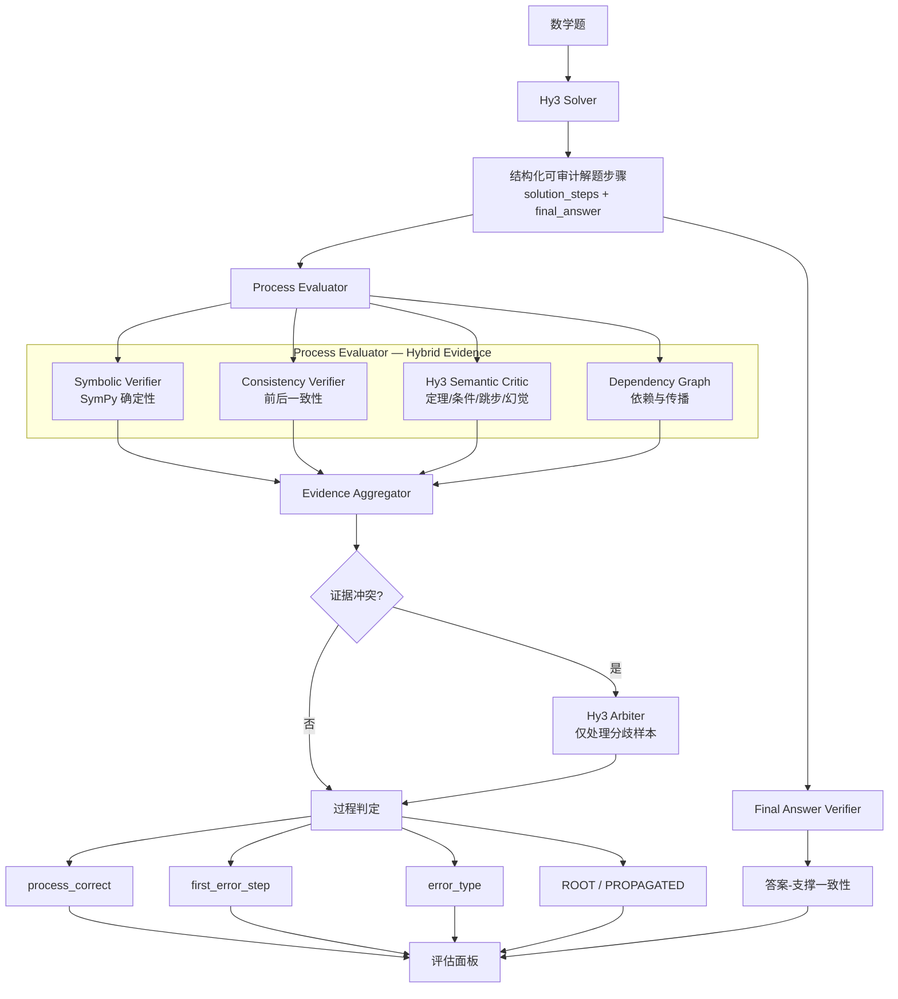

# MathXRay 项目方案

> **Hybrid Process Verification and Root-Cause Error Localization for Mathematical Reasoning**
>
> **Can a correct answer still be wrong?**
>
> 现有评估常把数学推理坍缩为"最终答案准确率"。MathXRay 评估的是：每一个结论，是否真的被它前面的推理所支撑。

---

## 0. 摘要（Executive Summary）

MathXRay 是一个基于 Hy3 的**数学推理解题与审计应用**。它不只是判断"最终答案对不对"，而是把一条推理链拆成原子步骤，逐步骤回答五个问题：

1. 最终答案是否正确？
2. 显式、可审计的推理过程是否成立？
3. 若不成立，**最早引入错误的步骤（earliest error）**是哪一步？
4. 错误属于什么类型？
5. 若答案正确，它是否真的被前序推理所支撑（而非"蒙对"）？

技术上，项目采用 **"确定性符号验证 + Hy3 语义审查 + 依赖图根因定位 + 选择性仲裁"** 的混合证据体系，避免退化成"LLM 生成 → LLM 判断 → 无法证明判断是否正确"的循环。

可信度上，项目用**第三方专家标注的 ProcessBench** 作为外部金标准，用**自建可控错误集 TraceAdversarialBench** 验证细粒度定位，用**人工抽检**回答"真实问题 vs 误报"。

**当前进度**：已完成实验地基与第一张真实 baseline 表（Phase 0–1），B0 Direct-Judge 在 20 条 smoke 样本上得到 M2 First-Error Exact = 0.3077。

---

## 1. 项目概述与设计思路

### 1.1 为什么是数学

数学是"可验证性"最强的场景：

- 有明确标准答案，数值/代数表达式可自动比较；
- 部分步骤可由 SymPy 等工具**确定性**验证；
- 存在成熟的过程监督 benchmark（ProcessBench）。

因此数学能让项目把"判断推理是否正确"这件事，落在**可证伪、可复现、有外部 gold** 的地基上，而不是停留在主观描述。

### 1.2 六条不可违反的设计原则

| 原则 | 含义 |
|---|---|
| **Solver / Evaluator 解耦** | 最终答案错 ≠ 第一步错；最终答案对 ≠ 过程对。二者分别判定、分别存储。 |
| **不依赖隐藏思维链** | Hy3 用 `reasoning_effort=high` 做内部推理，但对外输出**公开、结构化、可审计的 `solution_steps`**，评估针对显式步骤。 |
| **No Circular Ground Truth** | 禁止 "Hy3 生成 → Hy3 判定 → 拿判定当 gold → 证明自己有效"。gold 优先级：第三方专家标注 > 程序可证真值 > 独立人工审计 > LLM 弱标签。 |
| **No Final-Answer Leakage** | 过程评估器不得通过 gold final answer 推断过程对错。 |
| **UNKNOWN Is Valid** | 符号验证判不了就返回 `UNKNOWN`，不能为凑覆盖率强行猜 VALID/INVALID。 |
| **Raw-first 可复现** | 指标必须能从 `results/raw/*.jsonl` 重算；resume 不重复计数；正式结果不静默覆盖。 |

### 1.3 从 "Prompt Engineering" 到 "Evaluation System Engineering"

普通方案是 `Hy3 solve → Hy3 judge → 一个 JSON`。MathXRay 把它提升为一套**评估系统工程**：

```
Hy3 Solver → 原子化推理步骤
    → 符号验证 + 语义审查 + 依赖图
    → 冲突仲裁
    → 根因定位 + 答案-支撑一致性
    → 外部 ProcessBench 验证 + 自建可控对抗集
```

---

## 2. 整体架构

### 2.1 架构图



### 2.2 Hy3 的三个角色

| 角色 | 职责 | 调用时机 |
|---|---|---|
| **Hy3 Solver** | 生成结构化解题步骤与最终答案 | 每次求解 |
| **Hy3 Semantic Critic** | 审查定理适用、条件遗漏、逻辑跳步、幻觉等语义问题 | 每步语义审查 |
| **Hy3 Arbiter** | 仅当多路验证器冲突时二次仲裁 | 选择性调用 |

> 关键设计：Hy3 高成本二次审核**只处理分歧/低置信样本**，而非无条件多 Agent 跑三遍。

### 2.3 代码模块划分（已实现）

```
src/
├── llm/            # Provider 抽象 + Hy3 集成（含 reasoning_content 提取）+ mock
├── solver/         # math_solver / parser / schema（结构化步骤）
├── verifier/       # answer_verifier（答案校验栈）
├── evaluator/      # direct_judge（B0 Direct Judge）
├── benchmark/      # processbench_adapter / runner
├── analysis/       # metrics（M1–M5）
├── cache.py        # 缓存（key 含 model/prompt/config/input）
├── config.py       # YAML 配置
└── run_metadata.py # 运行元数据（run_id/commit/hash/seed）
```

---

## 3. 重点技术

### 3.1 原子化可验证推理步骤（Atomic Verifiable Reasoning Steps）

Solver 要求 Hy3 输出**一步一个核心推断**的公开步骤，而不是把五步推理压成一句话：

```json
{
  "step_id": 1,
  "statement": "one clear inference",
  "expression": "2x + 1",
  "depends_on": []
}
```

这样每一步都能被 evaluator 独立引用、独立验证，且不依赖供应商私有思维链格式，可替换模型、可复现。

### 3.2 混合证据验证（Hybrid Evidence Verification）

每步可获得四路证据，最终融合：

| 证据源 | 状态 | 覆盖 |
|---|---|---|
| Symbolic Verifier（SymPy） | VALID / INVALID / UNKNOWN | 算术、等式、代入、基础代数 |
| Consistency Verifier | VALID / INVALID / UNKNOWN | 条件前后矛盾、结论与上一步不一致 |
| Hy3 Semantic Critic | VALID / INVALID / UNKNOWN | 定理误用、条件遗漏、逻辑跳步、幻觉 |
| Dependency Graph | ROOT / PROPAGATED / INDEPENDENT / NONE | 错误因果传播 |

**核心原则**：SymPy **宁可 UNKNOWN 不做超范围强判**（precision-first）；能形式化的地方给高可信确定性证据，不能形式化的地方诚实 UNKNOWN。

### 3.3 依赖图与根因定位

普通方法会把被污染步骤全部报错：

```
Step 3 错 / Step 4 错 / Step 5 错 / Step 6 错
```

依赖图区分：

```
S3 ❌ (根因) → S4/S5 (传播) → S6 (传播)
```

最终输出不是"3、4、5、6 步都有问题"，而是 **"第 3 步是首个根因错误，第 4–6 步主要由其传播导致"**。这比课题要求的"错误步骤定位"更进一步。

### 3.4 错误分类体系（Taxonomy）

一级类别（12 类）：

```
PROBLEM_MISREAD / CONDITION_OMISSION / CONCEPT_ERROR / THEOREM_MISUSE /
LOGIC_GAP / CIRCULAR_REASONING / ALGEBRA_ERROR / ARITHMETIC_ERROR /
HALLUCINATION / ANSWER_FORMAT_ERROR / OTHER / UNKNOWN
```

传播属性（`ROOT_ERROR` / `PROPAGATED_ERROR` / `INDEPENDENT_ERROR`）作为**独立标签**，不与一级类型混为一维。

### 3.5 "答案正确但过程错误"检测（Unsupported Answer）

这是项目的核心卖点。设 `A = 最终答案正确`，`P = 过程正确`：

| | P 正确 | P 错误 |
|---|---|---|
| A 正确 | 正常正确 | **Lucky / Unsupported Answer** |
| A 错误 | 结论抄写/格式问题 | 正常错误 |

当 `A=True && P=False` 时标记 `unsupported_answer=true`，并通过 **Support Graph Check**（最终答案能否沿一条全部有效的依赖路径从题目条件推出）给出技术化解释。

### 3.6 可复现与 Provenance

每次 run 记录 `run_id / git_commit / model / prompt hash / config hash / dataset manifest hash / seed / raw response / parse failure / latency`，实现：

- raw → summary **可重算**；
- resume 以 `sample_id + method + run_signature` 去重；
- 正式结果不静默覆盖。

---

## 4. 评估数据设计

### 4.1 三层 Benchmark 体系

| Benchmark | 角色 | 规模目标 | 来源 |
|---|---|---|---|
| **SolveBench** | 评价 Hy3 Solver 解题能力与难度边界 | 500–800 题 | GSM8K / MATH / Omni-MATH |
| **ProcessBench** | Evaluator 的**第三方专家金标准** | 3400 题（完整） | Qwen/ProcessBench |
| **TraceAdversarialBench** | 自建**可控错误集**（first-error/type/unsupported 的确定 gold） | dev 100–200 + test 400–600 | 从已验证正确的轨迹注入错误 |

### 4.2 ProcessBench Preflight 实测

对 `Qwen/ProcessBench` 完成 schema preflight：

- **splits**：`gsm8k`(400) / `math`(1000) / `olympiadbench`(1000) / `omnimath`(1000)，合计 3400 条；
- **columns**：`id, generator, problem, steps, final_answer_correct, label`；
- **label 语义**：`-1` 表示过程正确（193 条），`1–7` 表示首个错误步骤（1-based）；
- **steps**：长度 2–16，均值 5.21；
- **final_answer_correct**：True 200 / False 200（默认 config）。

> label 的 `-1 / 1-based` 编码仅在 adapter 层转换为内部 canonical 表示（`null` 表示全过程正确），核心 evaluator 禁止混用，杜绝 off-by-one 隐患。

### 4.3 分层采样

正式运行前冻结分层采样规则（largest-remainder + 固定 seed=42），smoke=20 条按来源配比：gsm8k 3 + math 6 + olympiadbench 6 + omnimath 5。

---

## 5. 指标设计

### 5.1 主指标（ProcessBench）

| ID | 指标 | 定义 | 分母 |
|---|---|---|---|
| **M1** | Error Detection Recall | 在 gold 有错样本中，能否至少发现过程有问题 | `N_gold_error` |
| **M2** | **First-Error Exact Accuracy**（主指标） | `pred_first_error == gold_first_error` | `N_gold_error` |
| **M3** | Correct Process Accuracy | 在 gold 正确样本中，正确通过比例 | `N_gold_correct` |
| **M4** | Process Status Accuracy | 过程对/错二分类正确率 | `N_all` |
| **M5** | Official Composite | 复现官方 F1/综合指标 | `N_all` |

### 5.2 辅助定位指标

- **±1 Localization**：`|pred - gold| <= 1`（只作辅助，不替代 Exact）；
- **Mean Absolute Step Distance**：仅当 pred 与 gold 均为错误步骤时计算，漏检单独统计。

### 5.3 误报率口径（严格区分）

| 口径 | 公式 | 适用条件 |
|---|---|---|
| Classic FPR | `FP / (FP + TN)` | 有完整 gold process-correct 负类集合 |
| **Flagged-set FDP**（官方人工抽检） | `FP / (real_issue + FP)` | 人工抽检"答案正确但被判异常"的候选集 |

两者不能混称——这是官方指标最容易写错的地方。

### 5.4 统计协议

- 主指标报告 **95% bootstrap CI**（10,000 resamples）；
- Full vs B0 用 **paired bootstrap** 计算 `Δ = Metric_Full - Metric_B0`；
- CI 跨 0 时只写 "observed improvement"，禁止写"显著提升"。

---

## 6. 初步实验测试结果（B0 Direct-Judge smoke）

### 6.1 实验设置

- 方法：**B0 = Hy3 Direct Judge**（直接让 Hy3 判断过程是否正确 + 定位首错）；
- 模型：Hy3，`temperature=0, reasoning_effort=high, max_tokens=4096`；
- 样本：ProcessBench 分层采样 20 条（seed=42）。

### 6.2 主结果

| Metric | Value |
|---|---:|
| Error Detection Recall（M1） | 0.4615 |
| **First-Error Exact（M2）** | **0.3077** |
| Correct Process Accuracy（M3） | 0.8571 |
| Process Status Accuracy（M4） | 0.6000 |
| Official Composite（M5） | 0.5000 |
| ±1 Localization（辅助） | 0.3846 |

### 6.3 分来源结果

| Source | M2 First-Error Exact | M3 Correct Acc | M4 Status Acc | n |
|---|---:|---:|---:|---:|
| gsm8k | 1.0000 | 1.0000 | 1.0000 | 3 |
| math | 0.2500 | 1.0000 | 0.8333 | 6 |
| olympiadbench | 0.0000 | 0.6667 | 0.3333 | 6 |
| omnimath | 0.2500 | 1.0000 | 0.4000 | 5 |

### 6.4 Accounting（失败不隐藏）

| 项 | 值 |
|---|---:|
| n_all | 20 |
| n_gold_error | 13 |
| n_gold_correct | 7 |
| n_parse_failure | 8 |
| n_api_failure | 0 |

### 6.5 关键发现

1. **判定能力其实不差**：12 条 SUCCESS 中 `process_correct` 状态 12/12 与 gold 一致（6 正确全判对、6 有错全判错）。

2. **8 条 parse failure 全部为 `empty response`**：根因是 `reasoning_effort=high` 下，Hy3 的隐藏推理链（实测最长 15645 字符）计入 `max_tokens` 配额，吃满后 `content` 为空。推理链末尾可见模型在反复核对 JSON schema，说明**它严守输出格式，但被配额截断**——这是配置问题，不是判断力问题。

3. **M2 偏低的两大来源**：
   - **配额截断**（8/20）：推理链已显示意图判定，其中多条归因与 gold 一致；
   - **定位口径分歧**（2 条）：首错定在 gold 之前，属于"表述瑕疵 vs 实质性错误"的界定差异。

4. **加固方向已明确**：对 `content=""` 且 `reasoning` 非空的结果降级重试或提高配额；对 olympiadbench/omnimath 长推理单独配更高 `max_tokens`。

> 注：这是 20 条 smoke 的初步结果，用于验证主链路与暴露失败模式，**不作为正式结论**。正式 baseline 将在 Freeze 后按分层 pilot → full 梯度推进。

---

## 7. 最终预期效果

### 7.1 预期指标（目标值，非伪造值）

| 指标 | B0 Direct-Judge（现状） | Full 预期目标 |
|---|---|---|
| First-Error Exact（M2） | 0.3077（smoke） | 稳定优于 B0（paired CI 正向） |
| Correct Process Accuracy（M3） | 0.8571（smoke） | 不因定位提升而明显恶化 |
| Unsupported Answer Recall | — | 显著高于 B0 |
| 正确过程误报 | — | 明显下降 |

### 7.2 预期交付物

- 可一键运行的 Hy3 应用（Streamlit：Solve & Audit / Benchmark Dashboard / Error Explorer）；
- ProcessBench 完整评测 + B0/Full/消融对比表（含 95% CI）；
- TraceAdversarialBench 可控 gold 评测（first-error / type / unsupported）；
- 人工误报抽检记录（`manual_audit.csv`，n≈100）；
- 难度能力边界与临界点分析；
- ≤120s Demo；
- clean-clone 可复现。

### 7.3 能力边界分析预期

按 D1–D5 难度分层，寻找"过程监督能力相对解题能力更早断崖"的区间，并给出实证依据（最大相邻降幅 + bootstrap CI），不臆断、不事后挑图。

---

## 8. 时间规划与里程碑

以单人约 3 周为目标，按 **Gate 机制**推进（先 benchmark，后创新；先真实结果，后 UI）。

| 阶段 | 时间 | 核心目标 | Gate |
|---|---|---|---|
| **Phase 0** | Day 0–1 | 文档冻结 + repo/实验地基 | G0 |
| **Phase 1** | Day 1–5 | Hy3 主链路 + ProcessBench Direct baseline | G1 |
| **Phase 2** | Day 6–12 | Symbolic + Dependency + Adversarial + 初版消融 | G2 |
| **Phase 3** | Day 13–17 | Freeze + 正式评测 + 人工 audit + 难度 | G3 |
| **Phase 4** | Day 18–21 | UI/README/报告/Demo/clean-room 验收 | G4 |

**当前进度**：Phase 0–1 已完成（含 B0 smoke baseline 与失败诊断），即将进入 Phase 2 核心壁垒建设。

**Gate 阻断规则**：
- 未通过 G1（真实 baseline）→ 禁止投入 UI 美化；
- 未通过 G2（方法证明有效）→ 简化/修正方法，而非强行保留复杂模块；
- 时间不足时：先缩 UI 和 P2，不削减 P0、external baseline、manual audit、raw reproducibility。

---

## 9. 风险与缓解

| 风险 | 严重度 | 缓解 |
|---|---|---|
| ProcessBench label/index 理解错误 | Critical | preflight + adapter tests + 人工核对 ≥20 条 |
| Hy3 API 限流/不稳定 | High | cache + resume + 分层调用梯度 |
| `empty response`（推理链耗尽配额） | High | 检测后降级重试 / 提高 max_tokens / 按源分档 |
| Semantic Critic 误报高 | High | 冲突仲裁 + 人工抽检 |
| 依赖图自身产生错误 | High | 只作 evidence，可回退 |
| 自建 mutation 不真实 | High | source admission + 确定性验证 |
| 报告 claim 超出结果 | High | Claim Audit（每个强 claim 必须指向表/sample/CI/gold） |

---

## 10. 交付物清单（最终）

```
✓ Hy3 Solver + Process Evaluator + Symbolic Verifier + Dependency Graph
✓ Error Taxonomy + 答案自动校验 + ProcessBench Adapter
✓ TraceAdversarialBench + 消融脚本 + 人工审计记录
✓ raw/parsed/summary 结果 + 分析报告 + README + Demo
✓ 架构图 + 复现命令 + 成本/延迟报告 + 置信度校准
```
