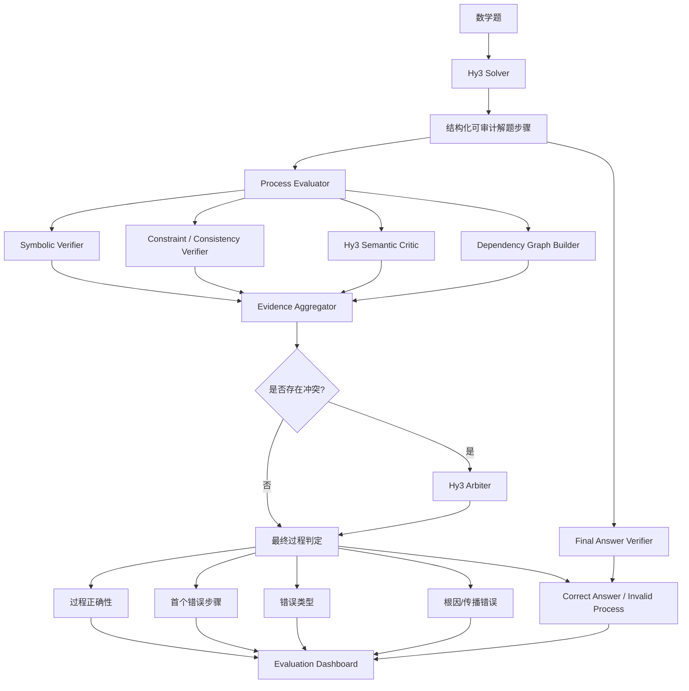

# MathXRay：可验证数学推理过程评估与错误根因定位系统

## 1. 项目定位

### 1.1 项目名称

**MathXRay**

副标题：

> Hybrid Process Verification and Root-Cause Error Localization for Mathematical Reasoning

### 1.2 一句话介绍

基于 Hy3 构建数学解题应用，并通过**符号验证 + 语义审查 + 推理依赖图 + 仲裁机制**，不仅判断最终答案是否正确，还定位推理链中第一个真正错误的步骤、识别错误类型，并检测“答案碰巧正确但推理无法支撑结论”的情况。

### 1.3 核心目标

作品不只回答：

> “答案对不对？”

而是回答五个问题：

1. 最终答案是否正确？
2. 整个推理过程是否成立？
3. 如果错误，**第一个根因错误发生在哪一步？**
4. 这是什么类型的错误？
5. 如果答案正确，这个答案是否真的由前面的推理支持？

---

# 2. 为什么选择数学方向

## 2.1 可验证性最强

数学具有：

- 明确标准答案；
- 数值/代数表达式可自动比较；
- 部分步骤可由 SymPy 等工具确定性验证；
- 存在成熟的过程监督 benchmark。

因此可以避免整个项目退化成：

> LLM 生成 → LLM 判断 → 无法证明 LLM 判断得对不对。

## 2.2 外部 Benchmark 与赛题高度匹配

采用三层评测体系。

### A. SolveBench：模型解题能力

用于评价 Hy3 自身：

- MATH；
- GSM8K；
- Omni-MATH 高难题子集。

指标：

- Final Answer Accuracy；
- Process Correct Rate；
- 难度分层 Accuracy。

### B. ProcessBench：过程评估器能力

直接使用公开 ProcessBench。

目标：

- 判断完整过程是否正确；
- 定位 earliest erroneous step；
- 正确过程不误报。

这是**第三方、人类专家标注的外部金标准**，用于证明我们的评估器不是“自己出题、自己判卷”。

### C. TraceAdversarialBench：自建可控错误集

从已验证正确的解答中自动注入错误，并保存：

- 注入位置；
- 错误类型；
- 修改前步骤；
- 修改后步骤；
- 最终答案是否保持正确。

专门评估：

- 错误类型识别；
- 首错定位；
- “答案正确但过程错误”检测。

---

# 3. 整体架构



---

# 4. 一个重要设计原则

## 不直接把模型隐藏思考当作被评估对象

Hy3 使用：

```text
reasoning_effort = high
```

提高内部推理能力。

但应用要求 Hy3 最终额外输出一组**公开、结构化、可审计的 solution_steps**：

```json
{
  "final_answer": "42",
  "solution_steps": [
    {
      "id": 1,
      "statement": "...",
      "result": "..."
    },
    {
      "id": 2,
      "statement": "...",
      "result": "..."
    }
  ]
}
```

过程评估针对 `solution_steps`。

这样：

- 不依赖供应商内部思维链格式；
- benchmark 可重复；
- 用户能够理解；
- 每一步都可独立验证；
- 后续可以替换模型。

---

# 5. Solver 设计

Hy3 Solver 负责生成完整解答。

要求模型输出：

```json
{
  "problem_summary": "...",
  "solution_steps": [
    {
      "step_id": 1,
      "claim": "...",
      "expression": "...",
      "depends_on": []
    }
  ],
  "final_answer": "...",
  "answer_type": "numeric"
}
```

其中每一步必须满足：

- 一个 step 尽量只包含一个核心推导；
- 明确输入条件；
- 明确结论；
- 数学表达式单独保留；
- 不允许把五步推理压缩成一句话。

目的不是让输出更长，而是形成：

> **Atomic Verifiable Reasoning Steps**

即“原子化可验证推理步骤”。

---

# 6. Process Evaluator

这是整个项目最重要的部分。

不采用单一 LLM Judge，而是采用：

> **Hybrid Evidence Verification**

---

## 6.1 Symbolic Verifier

负责可以形式化验证的步骤。

例如：

```text
Step 3:
x = 5

Step 4:
2x + 1 = 12
```

自动代入：

```text
2 × 5 + 1 = 11 ≠ 12
```

因此直接产生：

```json
{
  "step": 4,
  "verdict": "invalid",
  "source": "symbolic",
  "confidence": 1.0
}
```

可检查：

- 算术；
- 方程；
- 等式变换；
- 代数表达式；
- 数值替换；
- 简单不等式；
- 一部分集合/函数结果。

使用：

```text
SymPy
```

避免完全依赖 LLM。

---

# 7. Hy3 Semantic Critic

符号工具无法判断：

> “根据罗尔定理，因此……”

是否满足定理使用条件。

因此增加 Hy3 Critic。

输入：

```text
题目
+
Step 1 ... Step i
```

输出严格 JSON：

```json
{
  "step_id": 4,
  "status": "invalid",
  "error_type": "THEOREM_MISUSE",
  "reason": "...",
  "depends_on": [2, 3]
}
```

要求 Critic 区分：

- 当前步骤自身错误；
- 只是继承之前的错误。

这是普通 LLM Judge 往往做不到的。

---

# 8. 推理依赖图 Reasoning Dependency Graph

这是项目的第一项主要亮点。

普通方法：

```text
Step 3 错
Step 4 错
Step 5 错
Step 6 错
```

会给出四处错误。

但实际上可能只有：

```text
Step 3 = 根因
Step 4~6 = 被错误 Step 3 污染
```

因此构建：

```text
S1
 ↓
S2
 ↓
S3 ❌
 ↙  ↘
S4   S5
  \ /
   S6
```

每一个步骤保存：

```json
{
  "step_id": 6,
  "depends_on": [4, 5]
}
```

最终区分：

```text
ROOT_ERROR
PROPAGATED_ERROR
INDEPENDENT_ERROR
```

这样最终显示的不是：

> “第 3、4、5、6 步都有问题”

而是：

> **第 3 步是首个根因错误；第 4–6 步主要由该错误传播导致。**

这比课题要求的“错误步骤定位”更进一步。

---

# 9. 错误分类体系

建立稳定 taxonomy：

| 一级错误 | 说明 |
|---|---|
| PROBLEM_MISREAD | 题意/目标理解错误 |
| CONDITION_OMISSION | 条件遗漏 |
| CONCEPT_ERROR | 概念理解错误 |
| THEOREM_MISUSE | 定理使用错误 |
| LOGIC_GAP | 无依据跳步 |
| ALGEBRA_ERROR | 代数变换错误 |
| ARITHMETIC_ERROR | 计算错误 |
| CIRCULAR_REASONING | 循环论证 |
| HALLUCINATION | 引入不存在事实 |
| ANSWER_FORMAT_ERROR | 最终答案格式错误 |

另设置：

```text
PROPAGATED_ERROR
```

作为 secondary tag，而不是根因类别。

---

# 10. “答案正确但过程错误”检测

这是整个作品第二个重点亮点。

设：

```text
A = Final Answer Correct
P = Process Correct
```

产生四种情况：

| | P 正确 | P 错误 |
|---|---:|---:|
| A 正确 | 正常正确 | **Lucky / Unsupported Answer** |
| A 错误 | 结论抄写/格式问题 | 正常错误 |

重点关注：

```text
A = 1
P = 0
```

系统标记：

```json
{
  "final_answer_correct": true,
  "process_correct": false,
  "unsupported_answer": true
}
```

此外加入 **Support Graph Check**：

最终答案必须能通过依赖图中的一条全部有效路径，由：

```text
题目条件 → 中间推理 → Final Answer
```

得到。

如果答案虽然正确，但依赖路径上存在 invalid edge，则判定：

> Final answer is correct but unsupported by the reasoning trace.

这比单纯问 LLM：

> “过程有没有错？”

有更明确的技术定义。

---

# 11. TraceAdversarialBench

这是第三个主要亮点。

## 11.1 自动错误注入

从正确解答：

```text
S1 ✓
S2 ✓
S3 ✓
S4 ✓
S5 ✓
```

随机选择：

```text
S3
```

注入错误：

```text
S1 ✓
S2 ✓
S3 ❌
S4 ...
S5 ...
```

于是天然知道：

```text
gold_first_error = 3
```

不需要为所有样本手工标注。

---

## 11.2 确定性错误

优先自动生成可以程序保证错误的 mutation：

### ArithmeticMutation

```text
7 × 8 = 56
→
7 × 8 = 54
```

### SignMutation

```text
x = -3
→
x = 3
```

### OperatorMutation

```text
a + b
→
a - b
```

### DenominatorMutation

```text
a / 2
→
a / 3
```

### ConditionDeletion

删除：

```text
x > 0
```

然后使用需要该条件的结论。

---

# 12. Answer-Preserving Adversarial Mutation

专门构造最难样本：

> **错误过程 + 正确最终答案**

例如：

```text
Step 1: 正确
Step 2: 错误
Step 3: 错误
Final: 42
```

最后强制恢复标准答案：

```text
Final Answer = Gold Answer
```

于是：

```text
Final Answer Accuracy = 1
Process Correctness = 0
```

专门评测：

```text
Unsupported Answer Recall
```

这直接覆盖赛题中的高难要求。

---

# 13. 非循环式 Ground Truth

不能出现：

> Hy3 生成错误 → Hy3 判断这个错误是真的 → 再用这个数据证明 Hy3 Judge 很准。

因此数据分两种。

### Tier-A

程序能够确定真值：

- arithmetic；
- algebra；
- sign；
- operator；
- number substitution。

这部分无需 LLM 决定 gold。

### Tier-B

语义错误：

- theorem misuse；
- logic gap；
- hallucination。

使用：

- ProcessBench 外部人工金标准；
- 小规模人工审核。

这样避免自证循环。

---

# 14. Multi-Verifier 仲裁

每个步骤获得：

```text
Symbolic Verdict
Semantic Verdict
Dependency Verdict
```

例如：

```text
Symbolic: INVALID
Semantic: INVALID
Dependency: ROOT
```

直接判错。

如果出现：

```text
Symbolic: UNKNOWN
Semantic: INVALID
```

进入 Hy3 Arbiter。

如果：

```text
Symbolic: VALID
Semantic: INVALID
```

同样进入 Arbiter。

因此 Hy3 高成本二次审核只处理：

> difficult / disagreement samples

而不是全部多 Agent 跑三遍。

---

# 15. 置信度

输出：

```text
High
Medium
Low
```

来源不是单纯的 LLM 自报 confidence，而主要由：

```text
verifier agreement
+
symbolic evidence
+
arbiter agreement
```

计算。

例如：

```text
Symbolic + Semantic 均判错
→ HIGH

只有 Semantic 判错
→ MEDIUM

多个 verifier 冲突
→ LOW
```

UI 中对 LOW 样本展示：

> 建议人工复核

体现实际产品价值。

---

# 16. Benchmark 设计

最终至少建立三个 benchmark。

## Benchmark 1：SolveBench

约：

```text
500–800 questions
```

覆盖：

```text
基础
中等
困难
竞赛
Olympiad
```

评价 Hy3 Solver。

---

## Benchmark 2：ProcessBench

完整：

```text
3,400 samples
```

评价：

```text
First Error Localization
Correct Process Recognition
```

作为主要外部说服力。

---

## Benchmark 3：TraceAdversarialBench

建议：

```text
400–600 samples
```

包括：

```text
Arithmetic Error
Algebra Error
Condition Omission
Logic Gap
Correct-answer-but-wrong-process
```

---

# 17. 指标体系

## 17.1 Final Answer Accuracy

```text
# correct final answers / # all samples
```

## 17.2 Process Correct Accuracy

```text
# correctly classified process status / # all
```

## 17.3 First Error Exact Accuracy

```text
Predicted First Error == Gold First Error
```

这是核心指标。

## 17.4 ±1 Localization Accuracy

辅助指标：

```text
|pred - gold| <= 1
```

不能替代 exact。

## 17.5 Error Detection Recall

判断一个错误过程是否确实被发现。

## 17.6 Correct Process Accuracy

评估正常过程是否被正确放行。

## 17.7 ProcessBench F1

结合：

```text
Error Localization Accuracy
Correct Chain Accuracy
```

计算 harmonic mean。

与 ProcessBench 官方指标保持一致。

## 17.8 False Positive Rate

```text
FP / Gold Correct Process
```

## 17.9 Error Type Macro-F1

用于错误分类。

## 17.10 Unsupported Answer Recall

专门评价：

```text
Final Answer = Correct
Process = Incorrect
```

## 17.11 Calibration

额外增加：

```text
Confidence vs Actual Correctness
```

报告 ECE。

属于加分项。

---

# 18. 难度临界点分析

不是只画：

```text
easy / medium / hard accuracy
```

而是寻找：

> 模型在哪一个难度区间开始发生显著下降？

分别画：

```text
Final Answer Accuracy
Process Accuracy
Localization Accuracy
False Positive Rate
```

然后观察：

```text
D1 → D2 → D3 → D4 → D5
```

如果：

```text
Answer Accuracy:
92 → 87 → 76 → 58 → 31

Localization:
88 → 81 → 69 → 47 → 25
```

可以得出：

> 相比最终求解能力，过程监督能力在 D3→D4 更早发生能力断崖。

这就是课题要求的：

> 模型能力边界与临界点分析。

---

# 19. UI / Demo 设计

推荐 Streamlit。

页面顶部：

```text
MathXRay
Auditable Mathematical Reasoning
```

用户输入题目后依次显示：

### ① Hy3 Solution

Step 卡片：

```text
✓ Step 1
✓ Step 2
✗ Step 3
↓ propagated
! Step 4
! Step 5
```

### ② Final Answer

```text
Final Answer: 12
Gold Answer: 12

✓ Final answer correct
```

### ③ Process Integrity

```text
✗ Reasoning invalid

First root error:
Step 3
```

### ④ Error Type

```text
ALGEBRA_ERROR
```

### ⑤ Evidence

```text
Symbolic verifier:
lhs = 11
rhs = 12
therefore equality does not hold
```

而不是只显示一句：

```text
模型认为这里有错。
```

---

# 20. 产品语气

整体语气：

> **专业、审计式、证据导向，不拟人化批判。**

不要写：

> “你的推理很差。”

而写：

> “Step 4 无法由 Step 2–3 推出。代入已知条件后左侧为 11，而该步骤声称结果为 12，因此将 Step 4 定位为首个可验证错误。”

错误后给出：

```text
Problem
Evidence
Error Type
Suggested Correction
```

形成教学和审计双重价值。

---

# 21. 与普通参赛方案的差异

普通方案：

```text
Hy3 solve
   ↓
Hy3 judge
   ↓
一个 JSON
```

MathXRay：

```text
Hy3 Solver
   ↓
Atomic reasoning steps
   ↓
Symbolic verification
   +
Semantic verification
   +
Dependency graph
   ↓
Conflict arbitration
   ↓
Root-cause localization
   ↓
Answer-support consistency
   ↓
External ProcessBench validation
   +
Controlled adversarial benchmark
```

重点从：

> Prompt Engineering

提升为：

> **Evaluation System Engineering**

---

# 22. 最终论文式实验表

最终 README 首页直接放：

| Method | ProcessBench F1 ↑ | First-Error Acc ↑ | FPR ↓ |
|---|---:|---:|---:|
| Hy3 Direct Judge | XX | XX | XX |
| + Structured Steps | XX | XX | XX |
| + Symbolic Verifier | XX | XX | XX |
| + Dependency Graph | XX | XX | XX |
| **MathXRay** | **XX** | **XX** | **XX** |

再做：

| Difficulty | Final Acc | Process Acc | Localization Acc |
|---|---:|---:|---:|
| D1 | | | |
| D2 | | | |
| D3 | | | |
| D4 | | | |
| D5 | | | |

再做错误类别：

```text
Arithmetic
Algebra
Condition
Theorem
Logic
Hallucination
```

---

# 23. 消融实验

至少做四组：

```text
A0 Hy3 direct critic
A1 + structured atomic steps
A2 + symbolic verifier
A3 + dependency graph
A4 + arbitration
```

最终回答：

> 到底是哪一个模块产生了提升？

这是竞赛作品从“Demo”升级成“实验项目”的关键。

---

# 24. 项目目录

```text
mathxray/
│
├── app.py
├── README.md
├── pyproject.toml
├── .env.example
│
├── configs/
│   └── default.yaml
│
├── prompts/
│   ├── solver.md
│   ├── critic.md
│   ├── dependency.md
│   └── arbiter.md
│
├── src/
│   ├── llm/
│   │   └── hy3_client.py
│   │
│   ├── solver/
│   │   └── math_solver.py
│   │
│   ├── verifier/
│   │   ├── answer_verifier.py
│   │   ├── symbolic_verifier.py
│   │   └── consistency_verifier.py
│   │
│   ├── evaluator/
│   │   ├── process_judge.py
│   │   ├── dependency_graph.py
│   │   ├── error_classifier.py
│   │   └── arbiter.py
│   │
│   ├── benchmark/
│   │   ├── processbench.py
│   │   ├── solvebench.py
│   │   └── mutation.py
│   │
│   └── analysis/
│       ├── metrics.py
│       └── plots.py
│
├── scripts/
│   ├── prepare_data.py
│   ├── generate_solutions.py
│   ├── run_processbench.py
│   ├── build_adversarial_bench.py
│   ├── run_ablation.py
│   └── generate_report.py
│
├── data/
│   ├── raw/
│   └── processed/
│
├── results/
│
├── reports/
│   ├── audit.csv
│   └── final_report.md
│
└── tests/
```

---

# 25. 时间计划

以单人约 3 周为目标。

## Week 1：跑通产品主链路

完成：

```text
Hy3 API
↓
结构化 Solver
↓
Final Answer Verifier
↓
Hy3 Process Critic
↓
ProcessBench baseline
↓
Streamlit MVP
```

此时已经可以提交一个基本合格作品。

## Week 2：建立核心竞争壁垒

完成：

```text
Symbolic Verifier
Dependency Graph
Root Error
Mutation Engine
Correct-answer-invalid-process
ProcessBench 完整评测
```

这一周决定能否进入优秀作品。

## Week 3：变成奖金级作品

完成：

```text
Ablation
Difficulty Analysis
Manual Audit
Error Distribution
Dashboard
README
Report
Demo Video
Tests
Reproducible Scripts
```

---

# 26. Demo 视频脚本

总时长：

```text
约 110 秒
```

### 0–15s

介绍：

> “最终答案正确并不意味着推理正确。”

### 15–45s

输入一道题。

Hy3 输出完整步骤。

### 45–75s

MathXRay 逐步验证：

```text
Step 1 ✓
Step 2 ✓
Step 3 ✗
Step 4 propagated
```

展示具体证据。

### 75–95s

展示一个：

```text
Final Answer ✓
Process ✗
```

的反例。

### 95–110s

切换 benchmark dashboard：

```text
First Error Accuracy
FPR
Error Distribution
Difficulty Curve
```

结束。

---

# 27. 最终交付物

仓库至少提供：

```text
✓ 一键运行应用
✓ Hy3 Solver
✓ Process Evaluator
✓ Symbolic Verifier
✓ Dependency Graph
✓ Error Taxonomy
✓ ProcessBench Adapter
✓ 自建 TraceAdversarialBench
✓ 自动答案验证
✓ Evaluation Scripts
✓ Ablation Scripts
✓ Manual Audit Records
✓ Result CSV/JSON
✓ Analysis Report
✓ README
✓ Demo GIF / MP4
✓ Environment Example
✓ Unit Tests
```

额外提供：

```text
✓ Architecture Diagram
✓ Reproducibility Command
✓ Cost / Latency Report
✓ Error Case Explorer
✓ Confidence Calibration
```

---

# 28. 最重要的评审叙事

README 开头不要写：

> “本项目使用 Hy3 实现数学解题。”

而写：

> **Can a correct answer still be wrong?**
>
> Existing evaluation often collapses mathematical reasoning into final-answer accuracy. MathXRay evaluates whether each conclusion is actually supported by the reasoning that precedes it.
>
> We combine deterministic symbolic verification, Hy3-based semantic critique and dependency-aware root-cause localization, and validate the evaluator against expert-labelled ProcessBench as well as controlled adversarial reasoning traces.

然后直接展示一个：

```text
Final Answer: Correct ✓

Reasoning: Invalid ✗

First Root Error: Step 4

Error Type: THEOREM_MISUSE
```

这就是整个项目最容易被评委记住的视觉锚点。